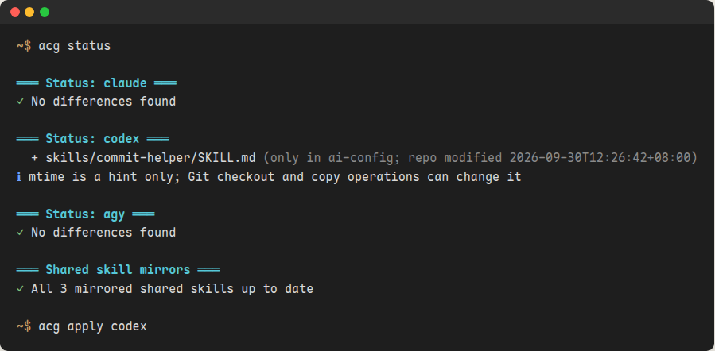
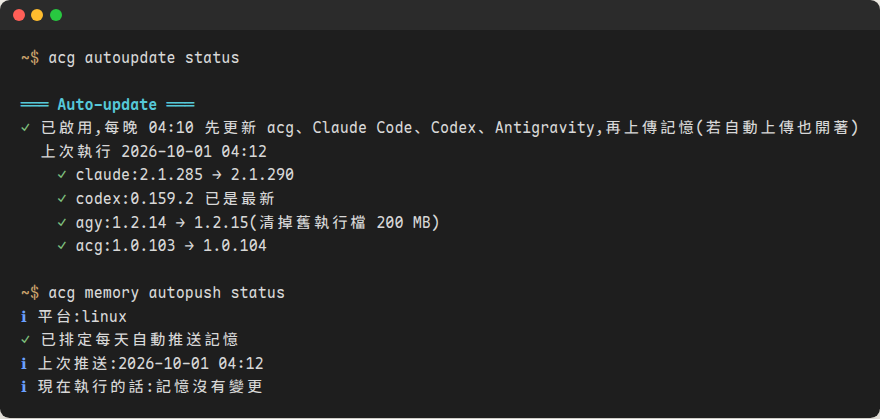
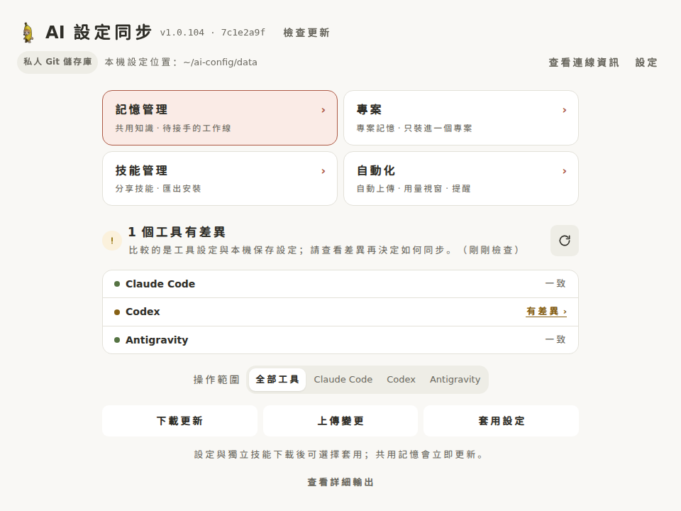
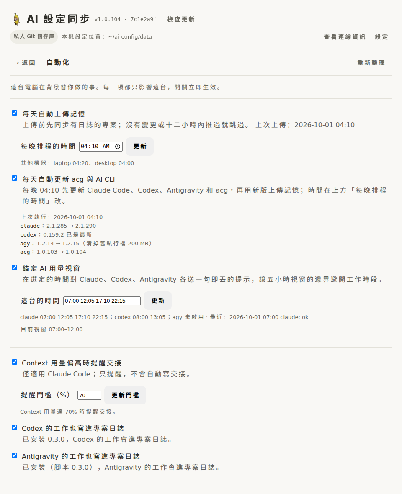
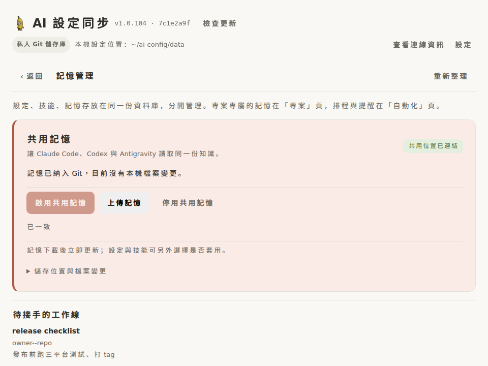
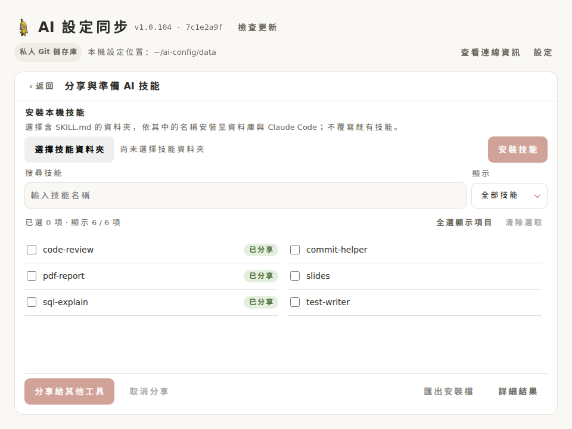

# ai-config

Cross-AI CLI configuration manager and sync engine for Claude Code, Codex, and
Antigravity.

The public tool repository contains the CLI, installers, and tests. Your private
configuration lives in a separate Git repository at the location selected during
setup. A source checkout is optional, and neither repository must be nested
inside the other.

From the terminal, `acg status` shows where each tool differs from the saved
configuration and `apply` deploys it. Each night the machine updates the AI CLIs
and then saves the shared memory by itself.

<p>
  
  
</p>

The desktop app does the same for people who would rather not use a terminal.

<p>
  
  
</p>

<details>
<summary>Memory and skills</summary>




</details>

Screenshots come from the app running on mock data: `cd gui && pnpm screenshots`.

## What it does

- **One copy of your AI setup, on every machine.** Rules (`CLAUDE.md`,
  `AGENTS.md`), skills, agents, commands, MCP servers and tool settings for
  Claude Code, Codex and Antigravity live in a private Git repository (or a
  Google Drive folder). `push` saves this machine's setup there; `pull` and
  `apply` bring another machine up to it.
- **Write a skill once, use it in all three tools.** Claude skills are
  projected to Codex (`~/.agents/skills`) and Antigravity
  (`~/.gemini/config/skills`) with their frontmatter adjusted.
- **A shared notebook.** With `memory enable`, all three tools read and write
  the same notes: a global layer and one layer per project, keyed by the
  project's Git remote so it matches across machines. It saves itself nightly.
- **Handoffs between sessions.** Record where a work thread got to before a
  context fills up; the next session picks it up, on this machine or another.
- **Messages between live sessions** (`msg`), **nightly tool updates**
  (`autoupdate`), and **usage-window anchoring** (`keepalive`).
- **Never copies credentials.** Login files are excluded everywhere, and every
  push is scanned for secrets before it leaves the machine.

## Installation

### Standalone installer

The released CLI bundles its own Python runtime. The target machine only
needs Git; it does not need Python, pip, pipx, or a tool repository checkout.

Each release is unpacked into its own directory under
`~/.local/share/ai-config/versions/`, and an update adds a directory rather
than overwriting a running file. On Linux and macOS `~/.local/bin/ai-config`
is a symlink to the active version; on Windows it is a small launcher that
runs the version recorded in `versions/active`. `acg update <version>`
switches back to a version still on disk without downloading it.

Bash — Linux, macOS, Git Bash, MSYS2, or Cygwin:

```bash
curl -fsSL https://github.com/CSL426/ai-config/releases/latest/download/install.sh | bash
```

On Windows, the shell installer delegates to the native PowerShell installer
automatically. The native installer also installs `acg.cmd` for PowerShell and
extensionless `ai-config`/`acg` launchers beside `ai-config.exe` for Git Bash.

Windows PowerShell:

```powershell
irm https://github.com/CSL426/ai-config/releases/latest/download/install.ps1 | iex
```

Installers register tab completion for commands, tools, and setup options.
Restart the terminal after installation, then try `ai-config <Tab>` or
`ai-config status <Tab>`. To activate a new or updated install immediately in
the current Bash process, run:

```bash
hash -r && source ~/.local/share/bash-completion/completions/ai-config.bash
```

With Bash's default Readline settings, press Tab twice to list ambiguous
choices such as `pull` and `push`; a unique prefix such as `acg pus<Tab>`
expands immediately.

To print the generated scripts directly, run `ai-config completion bash` or
`ai-config completion powershell`.

When no usable data repository is already configured, the installer starts
first-run setup in an interactive terminal. Setup asks where the private data
repository should live and, when needed, asks for its Git URL. It clones or
opens that repository, checks the required layout, creates and verifies a unique
temporary remote branch, then deletes it. The local path is saved only after the
real push and cleanup both succeed and the remote refs are confirmed restored.
If input is redirected, run `ai-config setup` after installation.

Non-interactive setup uses the same verification:

```bash
ai-config setup \
  --data-dir <path-to-config-repo> \
  --repo-url <your-config-repo-url>
ai-config status
```

The persisted path is stored in the platform user configuration directory:

- Linux: `${XDG_CONFIG_HOME:-~/.config}/ai-config/config.json`
- macOS: `~/Library/Application Support/ai-config/config.json`
- Windows: `%APPDATA%\ai-config\config.json`

`AI_CONFIG_REPO` remains the highest-priority runtime override. Repository URLs
containing embedded HTTP credentials are rejected; use SSH or the Git credential
manager instead.

### Installer automation

The installer can immediately run non-interactive setup after downloading the
binary:

```bash
curl -fsSL https://github.com/CSL426/ai-config/releases/latest/download/install.sh | \
  AI_CONFIG_REPO_URL=<your-config-repo-url> \
  AI_CONFIG_DATA_DIR=<path-to-config-repo> bash
```

Set `AI_CONFIG_VERSION` to install a specific release tag. `AI_CONFIG_BIN_DIR`
overrides the binary destination.

For a GitHub release installed with `uv tool install`, `acg update` uses uv
to install the latest release tag while keeping the tool and executable
directories. `acg update 1.0.39` installs that specific release, including a
downgrade. This does not update or apply the private configuration repository.

### Development install

Contributors working from a source checkout may still use an editable Python
installation:

```bash
python -m venv .venv
.venv/bin/pip install --editable .
```

If an old editable launcher shadows the standalone command, `update`
automatically delegates to the installed standalone executable instead of
requiring PATH or pyenv cleanup first.

## After installing

### The first machine

Gather what this machine already has, review it, and save it:

```bash
acg init          # copy live configuration into the data repository
acg status        # nothing should differ now
acg push          # shows the diff and asks before committing and pushing
```

### Every other machine

Look before you overwrite: `apply` replaces this machine's configuration with
the saved one, after a backup in `~/.ai-config-backup/`.

```bash
acg pull          # fast-forward the data repository, then show status
acg apply         # deploy it
```

In `status`, a `-` line is a file that exists only on this machine and that
`apply` would delete. If it is worth keeping, run `acg init` (or `acg push`)
before `apply`. In `~/.claude/skills` this includes skills installed by hand;
hand-installed skills in Codex's and Antigravity's folders are reported but
never deleted.

On a machine that has not applied the latest configuration, `apply` before
you `push`: a push gathers the live configuration, so it would save this
machine's older copy over the newer one. acg remembers the commit each apply
and push left this machine at; a push that would gather over later commits
lists them and asks first, and `--force` does not skip that question.
Without a terminal it stops instead of asking; `--overwrite-newer` is how you
say this machine's copy should win.

`acg setup` ends by printing which of these two paths applies, and the
desktop app shows the same next step on its home page, with the features
below that are still off, until the step is done.

### For an AI agent

`acg skill` prints a guide written for an agent: every command, what syncs
where, and the rules below. It is compiled into the binary and works before
`setup`. The `/acg` skill in Claude Code covers the same ground.

- Run `acg status` first; it is read-only.
- Never `push` without the user's approval; it commits.
- Without a terminal, add `--force` so `[y/N]` prompts are answered.
- Ask for the data repository's URL and path; never guess them.

## Optional features

Everything below is off until a machine turns it on, and each is set per
machine.

| Feature | Turn on | Where |
|---|---|---|
| Shared notebook, handoff reminder at 70% context | `acg memory enable` | Every machine |
| Save the notebook every night | `acg memory autopush enable [hour]` | Every machine; give each a different hour |
| Update Claude Code, Codex, Antigravity and acg nightly | `acg autoupdate enable` | Every machine; runs in the autopush slot |
| Start a tool's five-hour usage window at chosen times | `acg keepalive enable [HH:MM ...] [tool]` | **One machine per account**; the window belongs to the account |
| Send messages to other live sessions | `acg msg setup`, then start Claude with `claude-msg` | Linux and Windows; macOS Claude cannot receive yet |
| Record Codex and Antigravity sessions in the journal | `acg memory enable codex` / `agy` | Where you use them |
| Refuse commit messages that are not `type: description` | `acg hooks enable commit-style` | Optional |

`acg memory autopush status`, `acg autoupdate status`, `acg keepalive status`
and `acg hooks list` show what is on. A nightly run that fails is reported at
the start of the next Claude session until it succeeds.

Things to leave alone:

- **Do not edit `~/.agents/skills` or `~/.gemini/config/skills` by hand.**
  `apply` rebuilds every skill acg manages there from the Claude copy, so a
  file added inside one disappears; apply names such files and backs them up
  first. Change the skill in `~/.claude/skills` and push, or use
  `acg skill add <dir>`.
- **Do not copy acg's hooks into `settings.json` yourself.** They name this
  machine's executable, so acg keeps them out of the repository and puts
  them back on each machine. Your own hooks are synced; write their paths
  with `~/`, not `/home/<you>/`.
- **Settings that belong to one machine are never synced:** Claude's
  `permissions`, `env`, `model`, `effortLevel`, `autoMode`; Codex's
  `[projects.*]`, `notify`, `model`; Antigravity's `trustedWorkspaces`. A
  difference there is expected, not drift.
- **Do not sync `~/.ssh/config`.** See
  [two GitHub accounts](docs/multiple-github-accounts.md).

Environment variables: `AI_CONFIG_REPO` overrides the data repository path;
`AI_CONFIG_NO_PLUGIN=1` skips installing `/acg` into Claude Code;
`AI_CONFIG_NO_AUTOPUSH=1` stops the opportunistic memory save at the end of a
command; `AI_CONFIG_NO_AUTO_ADOPT=1` stops the nightly run from syncing new
project journals; `AI_CONFIG_NO_SHORTCUT=1` skips the Windows desktop
shortcut.

## Common problems

- **A new rule, skill or note does not show up.** Tools read them when a
  session starts. Open a new session; an open one does not reload.
- **Plugins are missing on a new machine.** After `apply`, Claude Code
  downloads the plugins your settings enable in the background on its first
  start. Run `/reload-plugins` or start it again.
- **`push` stops with "Potential credential content would be committed".** It
  lists the files. Replace a real value with a placeholder such as `<TOKEN>`
  or `$API_KEY`, which pass. Use `--allow-secrets` only after checking that
  what it flagged is not a secret.
- **`push` or `pull` refuses to start.** Both refuse states they cannot
  handle safely: pre-staged changes, a branch behind or diverged from the
  remote, a merge in progress. The message says which; `pull` before `push`,
  and commit or discard local edits in the data repository before `pull`.
- **Claude Desktop does not see your skills.** It does not read local skill
  folders. `acg package <skill>` makes a ZIP to upload under Settings →
  Customize → Skills. Codex and Antigravity desktop apps, and the Antigravity
  IDE, read the same skills as their CLIs.
- **Codex's skill-creator refuses `templates/` or `workflows/`.** Its
  scaffolding only accepts `scripts/`, `references/` and `assets/`. Codex
  itself loads any folder, and acg copies the whole skill.
- **Codex fails with `bwrap: loopback: Failed RTM_NEWADDR`** on Ubuntu 24.04.
  AppArmor stops unprivileged user namespaces from configuring networking.
  Allow bubblewrap with a profile, then run
  `sudo apparmor_parser -r /etc/apparmor.d/bwrap`:

  ```text
  # /etc/apparmor.d/bwrap
  abi <abi/4.0>,
  include <tunables/global>
  profile bwrap /usr/bin/bwrap flags=(unconfined) {
    userns,
    include if exists <local/bwrap>
  }
  ```

- **`command not found` right after installing or switching a tool.** The
  installer added a new folder to PATH, but a terminal app that was already
  running keeps the PATH it started with, and so do its new tabs. Close every
  window of the terminal app (Windows Terminal, or the IDE whose terminal you
  use) and start it again. To fix only the current shell, put the folder on
  PATH yourself, e.g. in Git Bash:
  `export PATH="$HOME/AppData/Local/Programs/OpenAI/Codex/bin:$PATH"`.
- **`msg setup` changes nothing on Windows.** PowerShell's execution policy
  may keep `$PROFILE` from loading; setup prints how to allow it.
## Reporting a bug

Open an issue at <https://github.com/CSL426/ai-config/issues>. Include:

- `acg --version` and the operating system
- the command you ran and its full output
- `acg status` if the problem is about what syncs

Remove anything private from the output first: repository URLs, host names,
paths under your home directory, and anything the credential check flagged.

## CLI usage

```bash
ai-config <command> [tool] [--force]
```

`--force` (`-f`) answers every `[y/N]` confirmation with yes, so an agent or a
script with no terminal can run `pull`, `apply` and `push` end to end. `reset`
ignores it: deleting every config file still has to be confirmed by a person.
A command that stops because it never got its confirmation exits non-zero.

- `init [tool]` — Gather local configs into the data repository.
- `apply [tool]` — Deploy configuration from the data repository.
- `status [tool]` — Preview repository-to-live differences.
- `pull [tool]` — Fetch and fast-forward a clean data repository, then show
  status without applying. Pull refuses dirty, detached, upstream-less, ahead,
  diverged, or in-progress Git states instead of entering conflict resolution.
- `push [tool]` — Gather local settings, show the repository diff, and ask before
  committing and pushing. If a previous push left reviewed commits ahead of the
  upstream, show and confirm those commits again without gathering or creating
  another commit. If `init` already collected unstaged changes entirely within
  the selected tools, review and publish those exact changes without gathering
  again. Push refuses pre-staged, out-of-scope, detached, behind, diverged, or
  upstream-less states, and cancels if the reviewed state changes.
- `sync [tool]` — Alias for `pull`.
- `project [tool]` — Project local Claude settings to other targets.
- `list` — List all managed tools.
- `package [skill]` — Zip a shared skill (`claude/shared/{both,agy,codex}`) for
  manual upload to Claude Desktop (Settings > Customize > Skills). Claude
  Desktop has no writable local skills directory, so this is a one-way export,
  not a live sync.
- `deploy [dir]` — Install chosen skills, Claude plugins and rules into one
  project instead of the user home, for working on a machine whose global
  configuration belongs to someone else. Each skill goes where its tools read
  it inside the project (`.claude/skills`, `.agents/skills` for Codex and
  Antigravity); plugins use Claude's project scope. Nothing under home is
  written, and nothing the project already has is deleted or overwritten.
  Choosing `memory` adds the shared-memory rules to the project's
  `AGENTS.md`, read by all three tools. `deploy --remove` takes everything
  back out when you leave the machine. See `docs/project-deploy-spec.md`.
- `reset` — Remove managed configuration files after confirmation.
- `skill` — Print the built-in usage guide, written for an AI agent that finds
  this CLI on a machine and needs to know how to drive it: the command table,
  what syncs where, the approval rules, and the known gotchas. The text is
  compiled into the binary, so it works before `setup` and needs no data
  repository — useful on a machine that has nothing configured yet.
- `completion bash|powershell` — Print a shell completion registration script.
- `update [version]` — Compare the installed standalone version with the latest
  release, then download only when an update is available. Native Windows updates
  hand off to PowerShell so the running executable can exit before replacement.
  Pass a version (`1.0.13` or `v1.0.13`) to install that release specifically;
  a pinned version skips the latest-release comparison, so it can also
  downgrade. Malformed versions are rejected before anything is downloaded.
- `autoupdate status|enable [hour]|disable|run` — Each night, before the
  memory push, run `claude update`, `codex update`, `agy update` and then
  `acg update` on this machine. It rides on the memory autopush schedule and
  its time, so the push runs with the acg just installed; the two switches are
  independent. Tools that are not installed are skipped, a Codex installed
  through npm is reported instead of updated, and one failure does not stop
  the rest. `status` shows the last run's versions; a failure is also shown at
  the start of a new Claude session and on the desktop app's automation page.
- `version` / `--version` / `-V` — Show the installed version without network
  access. Both command names show the shared `ai-config (acg)` product label.

Supported tools are `claude`, `codex`, `agy`, and `all`.

For a safe cross-machine workflow, pull and inspect before applying:

```bash
acg pull
acg apply
```

To publish this machine's selected settings:

```bash
acg push codex
```

The push command stages the selected tools before review, so new-file contents
are included in the displayed diff. It never force-pushes. If the reviewed
snapshot changes before commit, the push is cancelled and the collected changes
are left unstaged. If the remote changes after preflight, the normal
non-fast-forward rejection leaves the new commit local for manual review.
The proposed conventional commit message is derived locally from staged paths
and supported structured diffs; for example, model-only changes to Claude and
Agy settings produce `chore: update claude and agy model settings`. No AI or
external service is used to compose it.

If `init` was run separately first, `push` accepts its existing unstaged changes
when every changed path belongs to the selected tools. It skips gathering in
that case, preserving the collected snapshot for review. Pre-staged changes,
credential files, out-of-scope paths, or a mixture of dirty changes and
unpublished commits remain blocked.

Rerunning `push` safely resumes that ahead-only state: it scans every local
commit for out-of-scope paths and credential content, shows the commit list and
diff again, then asks before pushing the exact reviewed commit. It does not
gather new live changes or create another commit during a retry. Merge commits
and behind or diverged histories remain manual Git operations.

The pull command never rebases or autostashes. It fetches first and updates the
current branch only when `git merge --ff-only` is safe. Local commits or working
tree changes must be handled before pulling.

Codex settings remain under `~/.codex`, while user Skills are deployed to the
cross-surface `~/.agents/skills` directory used by Codex Desktop, CLI, and the
IDE extension. Antigravity global Skills are deployed to
`~/.gemini/config/skills`.

## Claude Code plugin

The installer puts acg's Claude Code plugin in on the first install, and
`acg update` installs it where it is missing and updates it where it is
present, so `/acg` arrives with the CLI. Set `AI_CONFIG_NO_PLUGIN=1` to skip
that, for example on a machine whose Claude Code belongs to someone else.
To install it by hand, pin the marketplace to the version `acg --version` prints:

```bash
claude plugin marketplace add CSL426/ai-config#v1.0.106   # your acg version
claude plugin install acg@acg
```

acg pins it the same way (`CSL426/ai-config#v<version>`) and moves the pin on every
update, so the plugin and the CLI always move together. Without a pin the
marketplace follows `main`, and Claude Code can refresh `/acg` ahead of the CLI.

Each subcommand is its own entry in the / menu: `/acg:status`, `/acg:sync`,
`/acg:save`, `/acg:share`, `/acg:memory`, `/acg:keepalive`, `/acg:autoupdate`,
`/acg:msg`, and
three for session handoff (`/acg:handoff` records where a work thread got to,
`/acg:handoffs` lists waiting threads, and `/acg:pickup` claims one and reads
its notes back). Typing `/acg <subcommand>` does the same.
The journal answers what happened in a project; handoff answers where one thread
got to, which matters when several sessions work on the same project at once.

The menu entries are user-only, so their descriptions stay out of Claude's
context until picked. A separate `acg` skill reads the same steps and fires
when someone says "交接" or "接著做" without typing anything.

### Handoff reminders before context compaction

Claude Code can remind you to record a handoff when its context usage reaches
a chosen percentage. `acg memory enable` turns it on at 70% on that machine
(a threshold already chosen is kept) and `acg memory disable` removes it:

```bash
acg memory handoff remind status
acg memory handoff remind enable     # default: 70%
acg memory handoff remind enable 80  # whole-number threshold: 1–99
acg memory handoff remind disable
```

The desktop memory page and `/acg handoff remind status|enable [percentage]|disable`
manage the same setting. `remind disable` turns it off while shared memory
stays on. The feature is specific to Claude Code. It reads the official context percentage through a statusLine
wrapper that preserves your existing status-line output. Settings and readings
stay on this machine.

At the threshold, the next prompt submission or completed tool call injects
one reminder per session compaction cycle, even if no thread has been claimed.
Missing, null, or stale readings are skipped. PreCompact only resets the
reminder state; it neither requests a handoff nor blocks compaction. A reminder
does not save notes automatically: use `/acg handoff` or
`acg memory handoff write` to record progress. See the
[handoff reminder specification](docs/handoff-reminder-spec.md).

## Two GitHub accounts on one machine

`acg login` binds an account to the data repository, but gh's credential helper
only ever answers as the machine-wide active account, so it cannot give a
different identity to a different repository. The fix is an SSH key and a host
alias per account, which bypasses the helper entirely. See
[docs/multiple-github-accounts.md](docs/multiple-github-accounts.md) — it also
explains why `~/.ssh/config` must not be synced.

## Data repository contract

The data repository is the source of truth. `init` gathers live configuration
into it; `apply` deploys its content to the corresponding tool home directories.
The configured repository, or the path overridden by `AI_CONFIG_REPO`, must
contain this layout:

```text
<data-repo>/
├── claude/
│   ├── rules/
│   ├── agents/
│   ├── commands/
│   ├── skills/
│   ├── settings.json
│   └── shared/
├── codex/
│   ├── config.toml
│   └── skills/
└── agy/
    └── settings.json
```

Credential files such as `auth.json` are excluded from synchronization.
Codex top-level `notify` and `[projects.*]` tables are machine-local: `init` and
`status` ignore them, while `apply` preserves the live machine's values.

## Development and testing

```bash
python -m pytest
ruff check ai_config tests
bash -n install.sh
git diff --check
```

### Desktop app (experimental)

A desktop window for people who would rather not use the terminal,
covering status/apply/pull/push, memory, skills, and project deploy
(pick a project folder, choose skills, plugins and memory rules, preview,
and take them back out later).

On Windows the released executable already contains it: download
`acg.exe` from the latest release and double-click it, or run `acg gui`.
The Windows installer puts an `acg` shortcut on the desktop and in the
Start menu on first install (set `AI_CONFIG_NO_SHORTCUT=1` to skip it);
`acg gui --shortcut` adds them again, and on Linux adds an app-menu entry
plus a desktop icon when a Desktop folder exists. Windows 10 builds without
Microsoft Edge WebView2 need that runtime installed first.

On Linux and macOS the released executable opens the same page in the
browser instead: `acg gui` serves it on 127.0.0.1 and opens the default
browser. The server stops about a minute and a half after the tab is closed.
On a machine without a display, such as one reached over SSH, it prints the
URL instead. Add `--port <n>` to pick the port, then forward it with
`ssh -L <n>:127.0.0.1:<n> <host>` and open the URL on your own computer.
Only the page acg opened can drive it. The link carries a one-time code that
becomes a session token, so a copied or reused link stops working. Folder
pickers become a path prompt, because the browser may be on another machine.
`--browser` forces this mode where a window could open.

To get a native window outside Windows, build and install from a source checkout:

```bash
cd gui && pnpm install && pnpm build # frontend → ai_config/gui_assets/
cd ..
python -m pip install -e ".[gui]"    # this checkout, including its built assets
acg gui
```

On Linux install `pywebview[qt]` in the same Python environment, or provide
the GTK backend's system packages (`gir1.2-webkit2-4.1` and `python3-gi` on
Debian and Ubuntu). Launch from a graphical desktop terminal; a plain SSH
session without X11 or Wayland cannot display the window.

A uv installation from Git does not include the ignored frontend build
output. Building in a separate checkout does not change that installed copy.

Roadmap and design notes: [docs/gui-plan.md](docs/gui-plan.md).

Additional documentation:

- [Architecture](docs/architecture.md)
- [Skills](docs/skills.md)
- [Development](docs/development.md)
- [Platform behavior](docs/platform-behavior.md)
- [Desktop app plan (draft)](docs/gui-plan.md)

## License

MIT
